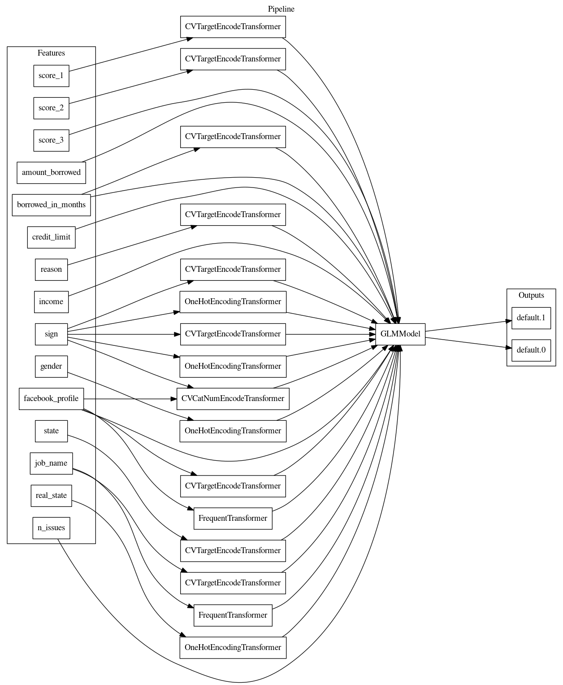

 Exemplo de aplicação de AutoML para este puzzle, clique aqui!

## Modelagem com AutoML

Varios modelos foram treinados e seus SCORES (AUC ROC) finais retidos. A tabela abaixo mostra a pontuação e o tempo de treinamento dos modelos lightgbm, tensorflow, xgboost, lineares e de árvore de decisão avaliados pelo H2O AutoML. A tabela mostra os 10 principais modelos de ajuste de parâmetros avaliados,
ordenada com base na combinação da maior pontuação e do menor tempo de treinamento.

| **job order** | **booster**   | **nfeatures** | **scores**   | **training times** |
|---------------|---------------|---------------|--------------|--------------------|
| 8             | lightgbm      | 32            | 0.7700415048 | 14.6204712391      |
| 1             | lightgbm      | 24            | 0.7698677154 | 14.1537275314      |
| 2             | lightgbm      | 24            | 0.7426194217 | 66.0755178928      |
| 23            | decision tree | 50            | 0.7405320862 | 3.4932367802       |
| 16            | gbtree        | 56            | 0.7678846301 | 7.4406349659       |
| 14            | lightgbm      | 57            | 0.7702787385 | 10.9978306293      |
| 12            | lightgbm      | 59            | 0.7635780158 | 50.2121686935      |
| 26            | tensorflow    | 53            | 0.7351773796 | 52.0274333954      |
| 21            | gbtree        | 58            | 0.7572955323 | 13.7841918468      |
| 13            | gbtree        | 61            | 0.7641460754 | 24.7108430862      |

### lightgbm tuning

| **tree method** | **grow policy** | **max depth** | **max leaves** | **colsample bytree** | **subsample** | **nfeatures** | **scores**   | **training times** |
|-----------------|-----------------|---------------|----------------|----------------------|---------------|---------------|--------------|--------------------|
| gpu_hist        | depthwise       | 6.0           | 0.0            | 0.8                  | 0.7           | 32            | 0.7700415048 | 14.6204712391      |
| gpu_hist        | depthwise       | 6.0           | 0.0            | 0.8                  | 0.7           | 24            | 0.7698677154 | 14.1537275314      |
| gpu_hist        | depthwise       | 10.0          | 0.0            | 0.8                  | 0.7           | 24            | 0.7426194217 | 66.0755178928      |
| gpu_hist        | depthwise       | 6.0           | 0.0            | 0.8                  | 0.7           | 57            | 0.7702787385 | 10.9978306293      |
| gpu_hist        | depthwise       | 6.0           | 0.0            | 0.8                  | 0.7           | 59            | 0.7635780158 | 50.2121686935      |
| gpu_hist        | depthwise       | 10.0          | 0.0            | 0.8                  | 0.7           | 24            | 0.7688460976 | 24.9808244705      |
| gpu_hist        | depthwise       | 10.0          | 0.0            | 0.8                  | 0.7           | 32            | 0.7684444332 | 25.3142881393      |
| gpu_hist        | depthwise       | 10.0          | 0.0            | 0.65                 | 0.5           | 53            | 0.7667040873 | 15.1145586967      |
| gpu_hist        | depthwise       | 10.0          | 0.0            | 0.55                 | 0.5           | 54            | 0.7673561155 | 12.6070151329      |
| gpu_hist        | depthwise       | 6.0           | 0.0            | 0.8                  | 0.7           | 32            | 0.7480079135 | 35.8614389896      |

### tensorflow tuning

| **booster** | **activation** | **layers**      | **learning rate** | **l1** | **l2** | **dropout** | **epochs** | **nfeatures** | **scores**   | **training times** |
|-------------|----------------|-----------------|-------------------|--------|--------|-------------|------------|---------------|--------------|--------------------|
| tensorflow  | elu            | [500, 500, 500] | 0.01              | 0.0    | 0.0    | 0.3         | 5          | 53            | 0.7351773796 | 52.0274333954      |
| tensorflow  | elu            | [500, 500, 500] | 0.1               | 0.0    | 0.0    | 0.2         | 5          | 61            | 0.7024291563 | 62.1853470802      |

### gbtree tuning

| **tree method** | **grow policy** | **max depth** | **max leaves** | **colsample bytree** | **subsample** | **nfeatures** | **scores**   | **training times** |
|-----------------|-----------------|---------------|----------------|----------------------|---------------|---------------|--------------|--------------------|
| gpu_hist        | depthwise       | 6.0           | 0.0            | 0.8                  | 0.7           | 56            | 0.7678846301 | 7.4406349659       |
| gpu_hist        | depthwise       | 10.0          | 0.0            | 0.65                 | 0.7           | 58            | 0.7572955323 | 13.7841918468      |
| gpu_hist        | depthwise       | 6.0           | 0.0            | 0.8                  | 0.7           | 61            | 0.7641460754 | 24.7108430862      |
| gpu_hist        | lossguide       | 0.0           | 1024.0         | 0.55                 | 1             | 25            | 0.6872814924 | 116.1333863735     |

### gblinear tuning

| **reg alpha** | **reg lambda** | **n lambda** | **min lambda fraction** | **nfeatures** | **scores**   | **training times** |
|---------------|----------------|--------------|-------------------------|---------------|--------------|--------------------|
| 0.0005        | 0.001          | 1            | 0.0001                  | 155           | 0.7011326581 | 20.5109436512      |
| 0.025         | 0.05           | 30           | 1e-06                   | 142           | 0.7681071079 | 181.1390459538     |

### decision tree tuning

| **tree method** | **grow policy** | **max depth** | **max leaves** | **nfeatures** | **scores**   | **training times** |
|-----------------|-----------------|---------------|----------------|---------------|--------------|--------------------|
| gpu_hist        | depthwise       | 11.0          | 32.0           | 50            | 0.7405320862 | 3.4932367802       |
| gpu_hist        | lossguide       | 10.0          | 128.0          | 55            | 0.7370039797 | 3.7135753632       |
| gpu_hist        | depthwise       | 4.0           | 32.0           | 60            | 0.7358627103 | 3.9421868324       |

### dart tuning

| **tree method** | **grow policy** | **max depth** | **max leaves** | **colsample bytree** | **subsample** | **nfeatures** | **scores**   | **training times** |
|-----------------|-----------------|---------------|----------------|----------------------|---------------|---------------|--------------|--------------------|
| gpu_hist        | depthwise       | 6.0           | 0.0            | 0.8                  | 0.7           | 62            | 0.7650765593 | 125.9983618259     |

## Estratégia de validação

O H2O AutoML divide automaticamente os dados de treinamento para determinar o desempenho do ajuste do parâmetro do modelo e das etapas de engenharia de recursos. Para o experimento, o H2O AutoML dividiu os dados aleatoriamente em dobras para validação cruzada. Com a validação cruzada, cada modelo é treinado em um subconjunto diferente dos dados de treinamento.

A visualização abaixo mostra como a validação cruzada é utilizada para obter previsões sobre os dados retidos.

## Engenharia de recursos

Durante a fase 'Model and Feature Tuning', o H2O AutoML avalia os efeitos de diferentes tipos de algoritmos, parâmetros e recursos de algoritmos. O H2O AutoML treinou  744 modelos e para cada um deles avaliou um conjunto diferente de recursos. 
esta fase de engenharia de recursos usa um algoritmo genético.

Alguns dos possiveis novos recursos são:

-   **ClusterDistTransformer**: the Cluster Distance Transformer clusters
    selected numeric columns and uses the distance to a specific cluster as a
    new feature.

-   **ClusterTETransformer**: the Cluster Target Encoding Transformer clusters
    selected numeric columns and calculates the mean of the response column for
    each cluster. The mean of the response is used as a new feature. Cross
    Validation is used to calculate mean response to prevent overfitting.

-   **InteractionsTransformer**: the Interactions Transformer adds, divides,
    multiplies, and subtracts two numeric columns in the data to create a new
    feature. This transformation uses a smart search to identify which feature
    pairs to transform. Only interactions that improve the baseline model score
    are kept.

-   **NumToCatTETransformer**: the Numeric to Categorical Target Encoding
    Transformer converts numeric columns to categoricals by binning and then
    calculates the mean of the response column for each group. The mean of the
    response for the bin is used as a new feature. Cross Validation is used to
    calculate mean response to prevent overfitting.

-   **NumToCatWoETransformer**: the Numeric to Categorical Weight of Evidence
    Transformer converts a numeric column to categorical by binning and then
    calculates Weight of Evidence for each bin. The Weight of Evidence is used
    as a new feature. Weight of Evidence measures the “strength” of a grouping
    for separating good and bad risk and is calculated by taking the log of the
    ratio of distributions for a binary response column.

-   **TruncSVDNumTransformer**: the Truncated SVD Transformer trains a Truncated
    SVD model on selected numeric columns and uses the components of the
    truncated SVD matrix as new features.

-   **CVTargetEncodeTransformer**: the Cross Validation Target Encoding
    Transformer calculates the mean of the response column for each value in a
    categorical column and uses this as a new feature. Cross Validation is used
    to calculate mean response to prevent overfitting.

-   **FrequentTransformer**: the Frequent Transformer calculates the frequency
    for each value in categorical column(s) and uses this as a new feature. This
    count can be either the raw count or the normalized count.

-   **WeightOfEvidenceTransformer**: the Weight of Evidence Transformer
    calculates Weight of Evidence for each value in categorical column(s). The
    Weight of Evidence is used as a new feature. Weight of Evidence measures the
    “strength” of a grouping for separating good and bad risk and is calculated
    by taking the log of the ratio of distributions for a binary response
    column.

-   **CatTransformer**: the Categorical Transformer sorts a categorical column
    in lexicographical order and uses the order index created as a new feature.
    This transformer works with models that can handle categorical features.

-   **OneHotEncodingTransformer**: the One-hot Encoding transformer converts a
    categorical column to a series of boolean features by performing one-hot
    encoding. The boolean features are used as new features.

-   **CVCatNumEncodeTransformer**: the Cross Validation Categorical to Numeric
    Encoding Transformer calculates an aggregation of a numeric column for each
    value in a categorical column (ex: calculate the mean Temperature for each
    City) and uses this aggregation as a new feature.

-   **NumCatTETransformer**: the Numeric Categorical Target Encoding Transformer
    calculates the mean of the response column for several selected columns. If
    one of the selected columns is numeric, it is first converted to categorical
    by binning. The mean of the response column is used as a new feature. Cross
    Validation is used to calculate mean response to prevent overfitting.

O gráfico abaixo mostra o efeito destas fases na evolução do desempenho.

 Exemplos de pipelines testadas, clique aqui!

.

.
Com as features originais e suas transformações e clusters, as principais e mais importantes são elencadas para o modelo final (desprezando as com imporancia menor que 0.003). Seguem as principais:

|    | **Feature**                                                         | **Description**                                                                                                                           | **Transformer**                                  | **Relative Importance** |
|----|---------------------------------------------------------------------|-------------------------------------------------------------------------------------------------------------------------------------------|--------------------------------------------------|-------------------------|
| 1  | 80_CVTE: facebook_profile: sign.0                                   | Out-of-fold mean of the response grouped by: ['facebook_profile', 'sign'] using 5 folds [internal parameters:(10, 10, 10)]                | Cross Validation Target Encoding                 | 1.0                     |
| 2  | 83_CVTE: facebook_profile: score_2.0                                | Out-of-fold mean of the response grouped by: ['facebook_profile', 'score_2'] using 5 folds [internal parameters:(10, 10, 10)]             | Cross Validation Target Encoding                 | 0.607                   |
| 3  | 60_CVTE: sign.0                                                     | Out-of-fold mean of the response grouped by: ['sign'] using 5 folds [internal parameters:(20, 3, 10)]                                     | Cross Validation Target Encoding                 | 0.247                   |
| 4  | 4_income                                                            | income (Orig)                                                                                                                             | None                                             | 0.2102                  |
| 5  | 29_CVTE: sign.0                                                     | Out-of-fold mean of the response grouped by: ['sign'] using 5 folds [internal parameters:(10, 3, 10)]                                     | Cross Validation Target Encoding                 | 0.1595                  |
| 6  | 54_CVCatNumEnc: borrowed_in_months: score_1: facebook_profile.count | Out-of-fold count of 'facebook_profile' grouped by: ['borrowed_in_months', 'score_1'] using 5 folds [internal parameters:('count', 100)]  | Cross Validation Categorical to Numeric Encoding | 0.1489                  |
| 7  | 35_Freq: borrowed_in_months                                         | Encoding of categorical levels of feature(s) ['borrowed_in_months'] to their counts                                                       | Frequency Encoding                               | 0.1414                  |
| 8  | 26_CVTE: score_2.0                                                  | Out-of-fold mean of the response grouped by: ['score_2'] using 5 folds [internal parameters:(10, 3, 10)]                                  | Cross Validation Target Encoding                 | 0.1351                  |
| 9  | 55_CVCatNumEnc: facebook_profile: sign: borrowed_in_months.mean     | Out-of-fold mean of 'borrowed_in_months' grouped by: ['facebook_profile', 'sign'] using 5 folds [internal parameters:('mean', 1)]         | Cross Validation Categorical to Numeric Encoding | 0.131                   |
| 10 | 64_CVTE: score_2.0                                                  | Out-of-fold mean of the response grouped by: ['score_2'] using 5 folds [internal parameters:(100, 1, 20)]                                 | Cross Validation Target Encoding                 | 0.1246                  |
| 11 | 46_Freq: borrowed_in_months: score_2                                | Encoding of categorical levels of feature(s) ['borrowed_in_months', 'score_2'] to value between 0 and 1 based on their relative frequency | Frequency Encoding                               | 0.0993                  |
| 12 | 0_amount_borrowed                                                   | amount_borrowed (Orig)                                                                                                                    | None                                             | 0.087                   |
| 13 | 54_CVCatNumEnc: borrowed_in_months: score_1: score_6.count          | Out-of-fold count of 'score_6' grouped by: ['borrowed_in_months', 'score_1'] using 5 folds [internal parameters:('count', 100)]           | Cross Validation Categorical to Numeric Encoding | 0.0818                  |
| 14 | 24_CVTE: reason.0                                                   | Out-of-fold mean of the response grouped by: ['reason'] using 5 folds [internal parameters:(10, 3, 10)]                                   | Cross Validation Target Encoding                 | 0.0747                  |
| 15 | 17_CVTE: gender.0                                                   | Out-of-fold mean of the response grouped by: ['gender'] using 5 folds [internal parameters:(10, 3, 10)]                                   | Cross Validation Target Encoding                 | 0.0726                  |
| 16 | 37_n_issues                                                         | n_issues (Orig)                                                                                                                           | None                                             | 0.0563                  |
| 17 | 58_Freq: sign                                                       | Encoding of categorical levels of feature(s) ['sign'] to value between 0 and 1 based on their relative frequency                          | Frequency Encoding                               | 0.0216                  |

## Modelo final

-   Os recursos ajustados do modelo final são os melhores recursos encontrados nas iterações de engenharia de recursos.

-   O transformador de destino indica o tipo de transformação aplicada à coluna de destino

#### Detalhes

| **parameter**                | **value**                  |
|------------------------------|----------------------------|
**Type**               | LightGBMModel
**Num Folds**          | 4
**Fitted features**    | 17
**Target Transformer** | LabelEncoder
**tree method**      | gpu_hist
**max depth**        | 3
**index**            | 0
**model class name** | LightGBMModel
**grow policy**      | depthwise
**max leaves**       | 8
**subsample**        | 0.5
**learning rate**    | 0.02
| boosting_type                | gbdt                       |
**colsample bytree** | 0.65

 Para mais detalhes, clique aqui

#### Parametros detalhados:

| **parameter**                | **value**                  |
|------------------------------|----------------------------|
| booster                      | lightgbm                   |
| dummy                        | False                      |
| eval_metric                  | binary                     |
| grow_policy                  | depthwise                  |
| labels                       | [0, 1]                     |
| learning_rate                | 0.02                       |
| lossguide                    | False                      |
| max_bin                      | 128                        |
| max_delta_step               | 0.0                        |
| max_depth                    | 3                          |
| max_leaves                   | 8                          |
| min_child_samples            | 200                        |
| min_child_weight             | 1                          |
| min_data_in_bin              | 10                         |
| model_class_name             | LightGBMModel              |
| n_estimators                 | 579                        |
| n_jobs                       | 1                          |
| num_class                    | 1                          |
| num_classes                  | 2                          |
| objective                    | binary                     |
| random_state                 | 629166531                  |
| reg_alpha                    | 0.0                        |
| reg_lambda                   | 5.0                        |
| **scale_pos_weight**         | 1.0 **(não balanceou)*     |
| score_f_name                 | AUC                        |

    
#### Performance

| **Scorer** | **Final ensemble scores on validation**  | **Final ensemble standard deviation on validation**  |
|------------|------------------------------------------|------------------------------------------------------|
| ACCURACY   | 0.8547343                                | 0.0009199295                                         |
| AUC        | 0.7736127                                | 0.001785905                                          |
| AUCPR      | 0.4490428                                | 0.003632543                                          |
| F05        | 0.4729906                                | 0.003916086                                          |
| F1         | 0.4509142                                | 0.002622708                                          |
| F2         | 0.5685654                                | 0.002571356                                          |
| GINI       | 0.5452254                                | 0.003571809                                          |
| LOGLOSS    | 0.3651623                                | 0.00156274                                           |
| MACROAUC   | 0.7726127                                | 0.001785905                                          |
| MCC        | 0.3367409                                | 0.003456307                                          |

**Matrix de confusão**

|           | **Predicted: 0** | **Predicted: 1** | **error** |
|-----------|------------------|------------------|-----------|
| Actual: 0 | 42,301           | 8,155            | 16%       |
| Actual: 1 | 4,368            | 5,142            | 46%       |

*Receiver Operating Characteristic Curve*

 Outras curvas - clique aqui

*Precision Recall Curve*

*Cumulative Lift*

*Cumulative Gains*

*Kolmogorov–Smirnov*

    
## Google AutoML

De forma semelhante, inserimos este .csv no módulo de AutoML do google, que mesmo com desempenho inferior ao H2O AutoML, retornou resultados interessantes:

    

